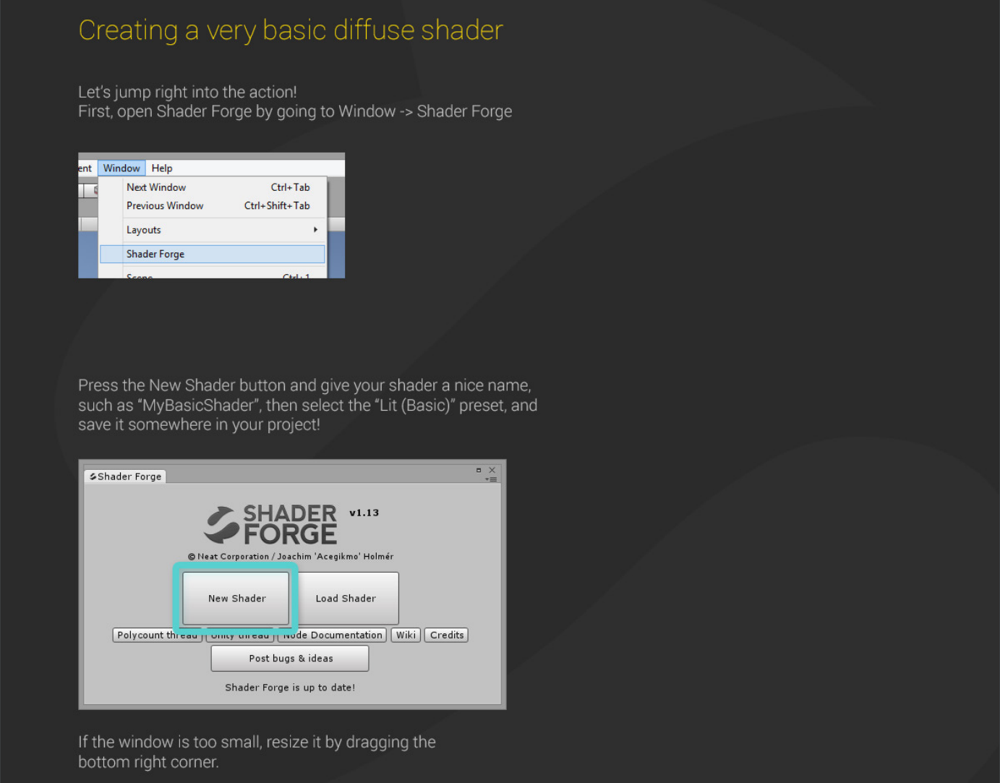
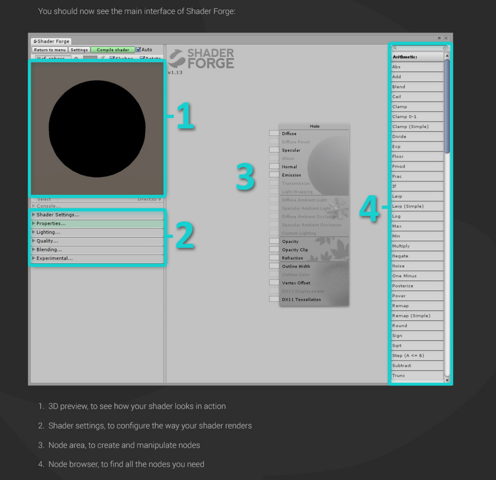
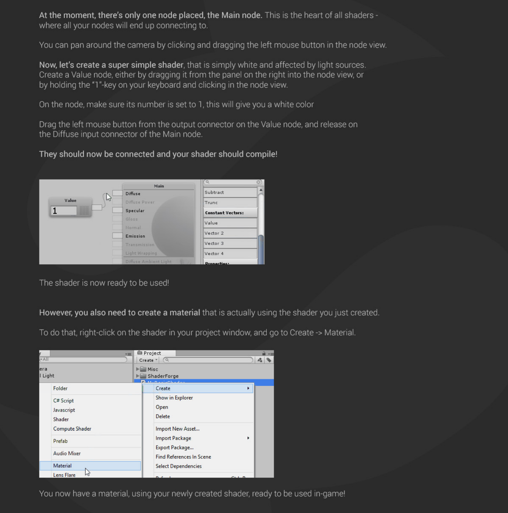
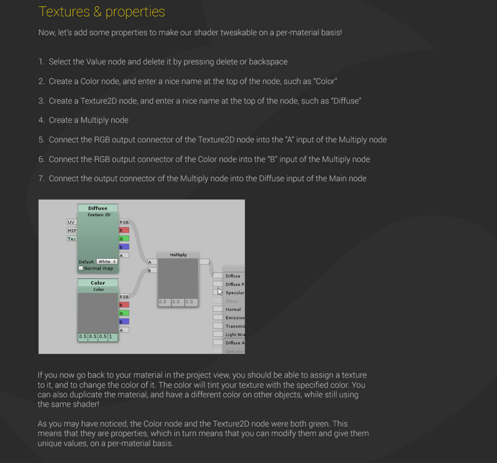
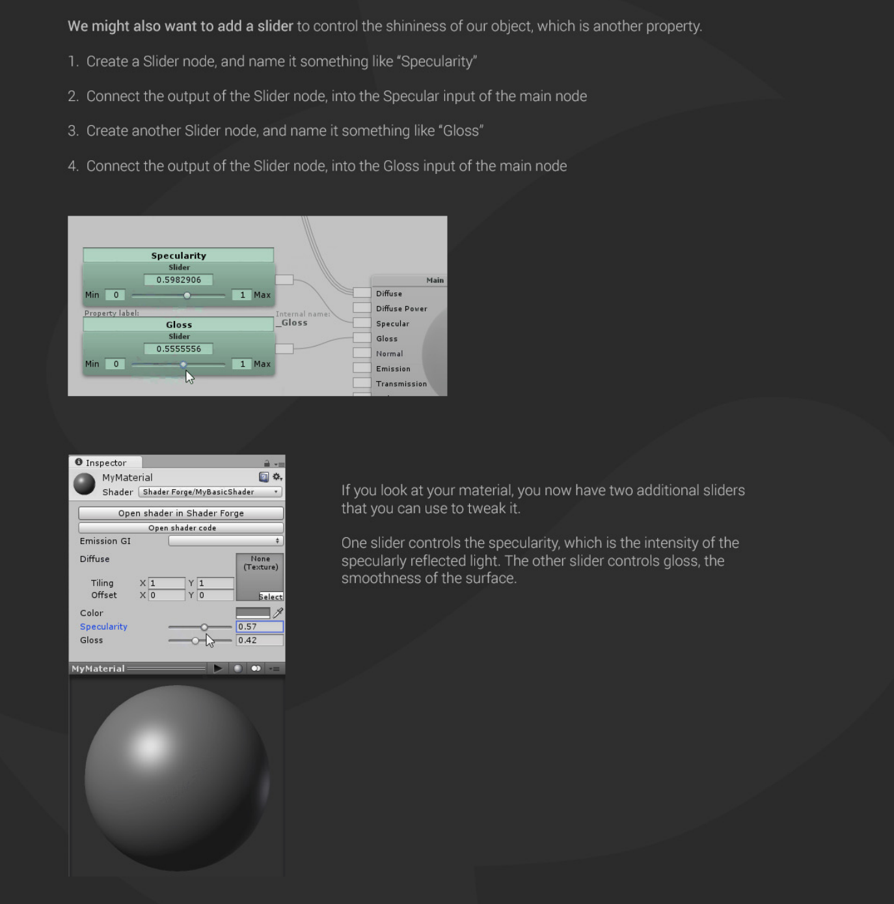

# SHADER FORGE

---

### To install, clone this repo to your assets folder.

## Quick start
- Panning = Click and drag empty space

- Zooming = Mouse wheel

- Adding nodes = RMB + select node OR drag from right panel and place OR hold the first letter of the node name, and scroll to the node you want, then click

- Moving nodes = Click and drag

- Selecting nodes = Click to select, shift/control click to add to selection

- Box select nodes = Hold Alt + Drag. Shift/control click to add to selection

- Deleting nodes = Select and press delete

- Deleting connections = Hold alt and drag RMB in empty space to start cutting lines.

- Disconnect connectors = Alt+RMB on connectors to disconnect them. Alternatively, hover the cursor over a connector and press backspace

## Nodes

### Main
This is the node in which all your other nodes in the end link to. It has several inputs that all serve different purposes.

The animated images below show all of the inputs and how they behave when changed over time.
Most of them animate back and forth between 0 and 1 (Black and White)

---

### Diffuse

This is the main color of your shaders. The diffuse color will receive light, have light falloff depending on the light-normal angle, and be shaded by shadows.

---

### Diffuse Power

This is the exponent of the falloff of the light-normal angle. Can be used to get an extra metallic look when using values above 1. Note that this does not currently conserve energy, whenever that is enabled.

---

### Specular

This is the color of the specular highlights of your shader. Higher values are brighter, black will not affect the shader at all.

---

### Gloss

This is the exponent of the specular highlights. Higher values will make it look shiny, values approaching 0 will make it look matte. Note that if you have unchecked gloss remapping, you should avoid using gloss values below 1.

---

### Normal

This is the tangent-space normal direction, where you can connect normal maps or custom normal vectors.

---

### Emission

This is simply light that is always added to your shader, regardless of the lighting conditions.

---

### Transmission

This controls how much light is passed through when the light source is behind the surface currently being rendered. This can be useful for thin materials such as cloth or vegetation.

---

### Light Wrapping

This is a way of controlling the light-normal angle falloff offset, which can be used to get an effect similar to subsurface scattering. Works best for smooth objects. Inputting a red-ish value will make the red channel "wrap around" the object more than the others, making it look as if light passed into the mesh, and came out with a red wavelength, similar to how skin is shaded.

---

### Diffuse Ambient Light

This adds light to your shader, affected by your diffuse. Can be used with, for example, cubemap using the normal direction for image-based lighting (IBL), or ambient light

---

### Specular Ambient Light

This adds light to your shader, affected by your specular. Can be used with, for example, a cubemap using the view reflection direction for image-based lighting (IBL)

---

### Diffuse Ambient Occlusion

This dampens indirect diffuse light, such as light probes, indirect light, and diffuse ambient light

---

### Specular Ambient Occlusion

This dampens indirect specular light, such as reflection probes, and specular ambient light

---

### Custom Lighting

This input is active when your shader is set to unlit, allowing you to define custom lighting behaviour. The nodes you put here are per-light.

---

### Opacity

Opacity controls the transparency of the final pixel. Note that partial transparency is generally finicky to get right, especially when using deferred rendering.

---

### Opacity Clip

Opacity Clip is a way of controlling if the current pixel/fragment should draw or not. Always use Opacity Clip for objects that need transparency, but not partial transparency, as Opacity Clip is easily sorted, which Opacity is not.

---

### Refraction

Refraction is a screen-space UV offset for refracting the background pixels. Make sure you set the alpha to something below 1 before using, so that the refraction effect is visible.

---

### Outline Width

This will add an outline to your shader, rendered as an offset mesh with reversed face normals. Note that hard edges will break the outline.

---

### Outline Color

This controls the color of the outline.

---

### Vertex Offset

This can be used to animate shaders over time, or change the shape of the object in various conditions. You simply insert a XYZ coordinate for how much each vertex should be offset.

---

### DX11 Displacement

This works very much in the same way as Vertex Offset, but is used in conjunction with DX11 tessellation. (Note that DirectX is Windows only, requires a DX11 GPU and has to be enabled in Unity)

---

### DX11 Tessellation

This controls how many subdivisions you want to split your triangles into. (Note that DirectX is Windows only, requires a DX11 GPU and has to be enabled in Unity)

---

### Add

A + LMB

Outputs the sum `A` + `B`

---
### Subtract

S + LMB

Outputs the difference `A` - `B`

---
### Multiply

M + LMB

Outputs the product `A` * `B`

---
### Divide

D + LMB

Outputs the quotient `A` / `B`

---
### Reciprocal

Outputs the quotient 1 / input

---
### Power

E + LMB

Outputs the power `Val` ^ `Exp`

---
### Sqrt

Outputs the square root of its input

---
### Log

Outputs the logarithm of its input. You can switch log base in the dropdown menu

---
### Min

Outputs the minimum of `A` and `B`

---
### Max

Outputs the maximum of `A` and `B`

---
### Abs

Outputs the absolute value of its input. Essentially; it makes negative values positive

---
### Sign

Outputs the sign of its input.

Values greater than 0 outputs 1

Values equal to 0 outputs 0

Values less than 0 outputs -1

---
### Ceil

Outputs its input rounded up to the nearest integer

---
### Round

Outputs its input rounded to the nearest integer

---
### Floor

Outputs its input rounded down to the nearest integer

---
### Trunc

Outputs its input rounded to the nearest integer towards zero. Essentially; it removes the decimals, leaving an integer

---
### Step (A <= B)

Outputs 1 if `A` is less than or equal to `B`, otherwise outputs 0

---
### Smoothstep

Blends smoothly between two values, based on where a third value is in that range, outputting values between 0 and 1. Think of it as a clamped inverse lerp with a smoothed output value.

---
### If

I + LMB

Outputs the `A&gt;B` input when `A` is greater than `B`

Outputs the `A=B` input when `A` is equal to `B`

Outputs the `A&lt;B` input when `A` is less than `B`

---
### Frac

Outputs the fractional part of its input. Essentially; it removes the integer part and keeps only the decimal part. An input of 4.32 would output 0.32. This node is particularly useful in conjunction with the Time node, which gives you a sawtooth wave over time

---
### Fmod

Outputs the remainder of `A` divided by `B`

---
### Clamp

Outputs its main input value, no less than `Min` and no more than `Max`

---
### Clamp (Simple)

The same as Clamp, but with two numerical inputs for Min and Max instead of node connectors

---
### Clamp 0-1

Outputs its input value, no less than 0 and no more than 1

---
### Lerp

L + LMB

Lerp is used to blend between two values or colors.

If `T` is 0, it will output `A`

If `T` is 0.5, it will output a halfway blend between `A` and `B`

If `T` is 1, it will output `B`

If `T` is any other value, it will output a linear blend of the two.

---
### Lerp (Simple)

The same as Lerp, but with two numerical inputs for `A` and `B` instead of node connectors

---
### InverseLerp

InverseLerp is usually used to remap ranges.

If `T` is equal to `A`, it will output 0

If `T` is halfway between `A` and `B`, it will output 0.5

If `T` is equal to `B`, it will output 1

If `T` is any other value, it will output a linear blend of the two.

---
### Posterize

Rounds values based on the value coming through `Steps`. A `Steps` value of 5 will create 5 bands in the 0 to 1 range

---
### Blend

B + LMB

Blends A over B using the specified method

---
### Remap

Remaps a value from one range to another. Same as Remap (Simple), but with inputs instead of numerical constants

---
### Remap (Simple)

R + LMB

Remaps a value from one range to another. For instance, if the node expects values from -1 to 1, but you want it to output a value from 2 to 5, you can type -1 and 1 on the first line, 2 and 5 on the second line

---
### Noise

Generates pseudorandom numbers based on a two-component input (Such as UV coordinates)

---
### One Minus

O + LMB

Outputs 1 minus its input. When used with color inputs, it will invert the color

---
### Negate

Outputs the main input multiplied by -1. Essentially makes positive values negative, and negative values positive

---
### Exp

When Exp is selected: Outputs e to the power of its input

When Exp 2 is selected: Outputs 2 to the power of its input

---
### Hue

Outputs an RGB color given a Hue

---
### HSV to RGB

Outputs an RGB color given a HSV (Hue, Saturation and Value) input. Hue and Saturation are between 0 and 1. Value is too, but can go beyond 1 to overexpose colors

---
### RGB to HSV

Outputs HSV (Hue, Saturation and Value) components given a color input. Hue and Saturation are between 0 and 1. Value can go beyond 1 for overexposed colors

---
### Value

1 + LMB

A numerical value, can also be called a "Vector 1". A property version is also available. Values can be used with the Append node to create Vectors with more components. Values can also be multiplied with vectors/colors. For example, a vector (3,1,0) multiplied by a value of 0.5, outputs the vector (1.5,0.5,0)

---
### Vector 2

2 + LMB

A vector with two components/values. Usually used with UV coordinates. Adding a Vector 2 to UV coordinates, will translate the UVs. Multiplying UV coordinates with a Vector 2 will scale the UVs

---
### Vector 3

3 + LMB

A vector with three components/values. Usually used as a color, position or direction

---
### Vector 4

4 + LMB

A vector with four components/values. Usually used as a color with an alpha channel, or as a position with some extra data in the fourth channel. There are two parameters to expose in the inspector available. Color and Vector 4 parameter

---
### Texture 2D

T + LMB

Contains a reference to a texture and will sample a texture at a specific UV coordinate with a specific MIP level (if connected). If the `Tex` input is connected by a Texture Asset node, this will no longer be a parameter in the inspector. Outputs `RGB` as well as separate channels

---
### Texture Asset

Contains a reference to a texture. This is used to sample a single texture multiple times - Can only be connected to the `Tex` input of Texture 2D nodes. This will also be reflected in the inspector of the material, so the user only need to assign one texture

---
### Value (Property)

A numerical value; same as Value, but exposed in the material inspector

---
### Vector 4 (Property)

A vector with four components/values, same as Vector 4, but exposed in the material inspector as 4 separate X, Y, Z and W values

---
### Color

A vector with four components/values, same as Vector 4, but exposed in the material inspector with a color picker

---
### Cubemap

Contains a reference to a cubemap and will sample a it in a specific direction with a specific MIP level (If connected). Outputs `RGB` as well as separate channels

---
### Slider

Allows you to easily tweak a value between a min and a max value. Is also exposed to the inspector

---
### Switch

Switches between two inputs based on a checkbox. Note that this cannot be used to optimize a shader, it will process both branches, but only show one

---
### Toggle

A value that is either 0 or 1 based on a checkbox

---
### Dot Product

Outputs the Dot product between `A` and `B`. Essentially; for two normalized vectors, it outputs how far they point away from each other. If they point in the same direction, it outputs 1, if they are perpendicular to each other, it outputs 0, if they point in opposite directions, it outputs -1.

Dropdown selections:
- Standard - Regular Dot Product
- Positive - Makes all negative values 0
- Negative - Makes all positive values 0
- Abs - Makes all negative values positive
- Normalized - Outputs in the range 0 to 1 instead of -1 to 1

The graph below show how the different modes behave when using two normalized vectors.

On the X axis you have the angle between them, on the Y axis you have the output value:

---
### Cross Product

Outputs the Cross product of `A` and `B`. Essentially; it outputs a vector perpendicular to both input vectors

---
### Reflect

Outputs the reflection vector of an incoming vector `I` as if reflected/bounced on a surface with the normal `N`

---
### Normalize

N + LMB

Outputs the normalized version of the input vector. Essentially; sets the length of the vector to 1, while keeping the same direction

---
### Append

Q + LMB

Outputs a single vector from multiple input values/vectors. For example, if `A` is a Vector 2, and `B` is a Value (Vector 1), the node will output a Vector 3, where `A` is in the red and green channel, while `B` is in the blue channel

---
### Component Mask

C + LMB

The component mask can be used to reorder or extract channels of a vector

---
### Desaturate

Outputs a desaturated version of the input `Col`. `Des` Determines how desaturated it is. A value of 1 means fully desaturated, 0.5 means half-desaturated, 0 means no desaturation

---
### Channel Blend

Outputs the sum of each component of the mask multiplied by the corresponding color input. Useful for triplanar blending

---
### Normal Blend

Combines two tangent-space normal directions, where the base normal is perturbed by the detail normal

---
### Distance

Outputs the distance between the two input points `A` and `B`

---
### Length

Outputs the length/magnitude of its input vector

---
### Transform

Transforms a vector from one space to another. You can switch between world/local/tangent/view. The built-in vectors are in world space. Directions into the normal input is in tangent space.

---
### Vector Projection

Outputs vector `A` projected onto vector `B`

---
### Vector Rejection

Outputs vector `A` rejected from vector `B`

---
### DDX

Outputs the partial derivative (rate of change) of the input vector in screen space along the X-axis

---
### DDY

Outputs the partial derivative (rate of change) of the input vector in screen space along the Y-axis

---
### DDXY

Outputs the absolute sum of the two partial derivatives (rate of change) of the input vector in screen space along the X and Y-axis. Known as fwidth() in code.

---
### Panner

P + LMB

Outputs the input `UV` coordinates, panned/offset by `Dist` distance, in the direction/speed specified by the U and V parameters

---
### Rotator

Outputs the input `UV` coordinates rotated by `Ang` radians around the pivot point `Piv`. If `Ang` is not connected, or connected to a time node, `Spd` will control the rotation speed

---
### Parallax

Outputs the input `UV` coordinates with a parallax offset derived from the `Hei` input, with a depth of `Dep` and a reference height `Ref`.

A `Ref` height of 0 means it will parallax as if the heightmap sticks out from the mesh

A `Ref` height of 1 means it will parallax as if the heightmap goes down into the mesh

---
### UV Tile

UV Tile can be used to get a tile within a tilemap, in the form of UV coordinates.

`UV` is the base UVs to get a tile inside

`Wid` is the amount of tiles along the tilemap's width

`Hei` is the amount of tiles along the tilemap's height

`Tile` is the index of the tile in the tilemap you want to extract. Specify this as an integer, where 0 is the first tile, starting from the bottom left.

---
### UV Coordinates

U + LMB

Outputs the specified UV coordinate for this part of the geometry. The dropdown allows you to select either UV channel 0 or UV channel 1. Note that lightmapped meshes use UV1 for their lightmap UVs

---
### Object Position

Outputs the world position of the object's pivot point

---
### Object Scale

Outputs the scale of the object. Checking reciprocal is computationally cheaper, but gives you the inverse scale (1 / scale). Note that this will not work if the mesh is batched.

---
### Screen Position

Outputs the screen position of the current part of the mesh, can be used as UV coordinates for screen-space mapping. In the dropdown box, "Normalized" will put {0,0} in the center of the screen, and {1,1} in the top right. "Tiled" will keep {0,0} in the center, but will scale on the X axis based on your aspect ratio

---
### World Position

Outputs the position of the current part of the mesh in world space

---
### Vertex Color

V + LMB

Outputs the vertex color. If you've baked ambient occlusion in the vertex colors, or want to tint the mesh with painted colors, or use vertex colors for anything else, this is the node you want

---
### Fresnel

Outputs the dot product between the surface normal and the view direction. `Nrm` is used if you want to use a custom normal. By default, the perturbed normal is used. `Exp` changes the exponent of the output. Higher values will make the fresnel thinner

---
### Normal Direction

Outputs the direction of the mesh normal, in world space. The Perturbed checkbox makes it use the normals after having applied the "Normal" input of the main node, such as a normal map.

---
### Bitangent Direction

Outputs the direction of the mesh bitangent, in world space

---
### Tangent Direction

Outputs the direction of the mesh tangent, in world space

---
### View Direction

Outputs the direction from the current part of the geometry to the camera, in world space

---
### View Reflection

Outputs the direction of the view as if bounced according to the surface normal. This can be used as input for cubemaps for perfect reflections

---
### Face Sign

This is used to detect if the current face is a frontface or a backface. Outputs 1 on frontfaces, and either -1 or 0 for backfaces, depending on what you specify in the dropdown box.

---
### Light Color

Outputs the color of the current light being rendered

---
### Light Attenuation

Outputs the light attenuation. This node contains both the light falloff and shadows in one

---
### Ambient Light

Outputs the ambient light of the scene the shader is being rendered in

---
### Light Direction

Outputs the direction to the current light being rendered

---
### Half Direction

Outputs the half-direction. This is the direction that points halfway between the view and the light vector, which is commonly used in the blinn-phong specular model

---
### Light Position

Outputs the position of the current light being rendered.

`Pnt` Outputs 1 if the current light being rendered is a point light, otherwise it outputs 0

---
### Time

Outputs time at different rates.

`t/20` outputs the time running 20 times slower

`t` outputs the current time

`t*2` outputs the time running twice as fast

`t*3` outputs the time running thrice as fast

---
### View Position

Outputs the current location of the view/camera (Note that when using perspective cameras, the view position is "behind" the screen)

---
### Projection Parameters

Outputs four projection parameters.

`Sign` is -1 if currently rendering with a flipped projection matrix, otherwise it's 1

`Near` is the near plane distance of the current camera

`Far` is the far plane distance of the current camera

`1/Far` is the reciprocal distance of the far plane

---
### Screen Parameters

Outputs four screen parameters.

`pxW` is the width of the screen in pixels

`pxH` is the height of the screen in pixels

`1+1/W` is 1 plus the reciprocal of the screen pixel width

`1+1/H` is 1 plus the reciprocal of the screen pixel height

---
### Pixel Size

Outputs the size of each pixel as a percentage of the screen width and height.

For example, with a resolution of 8x4, this would output a vector with values (0.125, 0.25)

---
### Fog Color

Outputs the color of the fog in the current scene

---
### Scene Color

A texture containing a render of the scene before this object was rendered. By default, its UVs are in screen space, making each pixel represent the color behind the object. This can be used for more advanced blending/transparency effects, or a manual way of making refraction if the UVs are altered, among other things

---
### Scene Depth

The depth from the camera to the scene behind the current pixel. Note: You have to turn off depth buffer writing in the blend settings, and you need to use a <a href="http://docs.unity3d.com/Documentation/Components/SL-CameraDepthTexture.html)camera that renders a depth texture</a>

---
### Depth Blend

This outputs a value between 0 and 1, depending on how close this pixel is to the background geometry, based on the distance input. Useful for fading out edges of water, or softening up lightshafts intersecting geometry. Note: You have to turn off depth buffer writing in the blend settings, and you need to use a <a href="http://docs.unity3d.com/Documentation/Components/SL-CameraDepthTexture.html)camera that renders a depth texture</a>

---
### Depth

This is the distance from the camera's near plane to the object itself

---
### Pi

Outputs the value of Pi, the ratio of a circle's circumference to its diameter (Approximately 3.141593)

---
### Tau

Outputs the value of Tau, the ratio of a circle's circumference to its radius (Approximately 6.283185)

---
### Phi (Golden ratio)

Outputs the value of Phi, the golden ratio (Approximately 1.618034)

---
### Root 2

Outputs the square root of two (Approximately 1.414214)

---
### e (Euler's Constant)

Outputs Euler's constant e (Approximately 2.718282)

---
### Sin

Outputs the sine of its input

---
### Cos

Outputs the cosine of its input

---
### Tan

Outputs the tangent of its input

---
### ArcSin

Outputs the arcsine of its input, in radians

---
### ArcCos

Outputs the arccosine of its input, in radians

---
### ArcTan

Outputs the arctangent of its input, in radians

---
### ArcTan2

Outputs the arctangent of its two inputs coordinates. The range and unit depends on the dropdown box. By default it's in radians, from -pi to pi.

---
### Matrix 4x4

A constant matrix. The initial values are that of an identity matrix

---
### Matrix 4x4 Property

A matrix property. You can assign to it on the C# end using myMaterial.SetMatrix

---
### Multiply Matrix

A matrix multiply node. Can be used to transform vectors, spaces, or other matrices. You can assign to it on the C# end using myMaterial.SetMatrix(). Note that matrix multiplication is not commutative. That is to say, A * B is not the same thing as B * A

---
### Transpose

Outputs the transpose of a matrix

---
### Code

A node for doing custom code inside a shader. In the example to the left, the node will work similar to a lerp, that curves towards `mid` before reaching `end`

---
### Relay

Outputs its input, useful for organizing node connections

---
### Set

Saves a variable to be reused later. Useful for cleaning up large node trees

---
### Get

Gets one of the previously defined variables using the Set node. Useful for cleaning up large node trees</td></tr></table>
